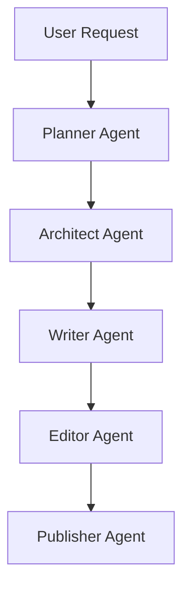

# Chinese WebNovel Master

> Don't just write novels. Engineer reader addiction.

Chinese WebNovel Master is a specialized AI writing system designed for Chinese web fiction.

Unlike traditional writing assistants, it focuses on the complete commercial web novel workflow:

* Market Analysis
* Story Planning
* World Building
* Chapter Writing
* Quality Review
* Publishing Optimization

The project uses a multi-agent architecture and an integrated knowledge base built from successful Chinese web fiction patterns.

---

## Features

### Market-Oriented Story Planning

Analyze:

* Genre trends
* Reader demand
* Platform suitability
* Commercial potential

Supported platforms:

* Tomato Novel (番茄小说)
* Qidian (起点中文网)
* Feilu (飞卢小说网)
* Jinjiang (晋江文学城)

---

## Quick Start

1. Open `SKILL.md`
2. Load Planner Agent
3. Generate Market Analysis
4. Generate Story Architecture
5. Generate Chapters
6. Review with Editor Agent
7. Prepare Publishing Package

### Multi-Agent Workflow

Chinese WebNovel Master simulates a professional web novel production team.

---

### Integrated Knowledge Base

Built-in writing knowledge includes:

* Platform-specific reader preferences
* Title generation patterns
* Suspense hook systems
* Character templates
* Power system templates
* Retention optimization frameworks

---

### Commercial Publishing Optimization

Generate:

* High CTR titles
* Platform-specific tags
* Novel synopsis
* Marketing copy
* Launch strategy

---

## Architecture



## Example Workflows

| Genre | Example |
|--------|----------|
| Urban System | [urban_system.md](examples/urban_system.md) |
| Xianxia | [xianxia.md](examples/xianxia.md) |
| Apocalypse | [apocalypse.md](examples/apocalypse.md) |
| Romance | [romance.md](examples/romance.md) |


| Document | Description |
|----------|-------------|
| [quickstart.md](docs/quickstart.md) | Getting Started Guide |
| [architecture.md](docs/architecture.md) | System Architecture |
| [workflow.md](docs/workflow.md) | Full Workflow Guide |

---

## Project Structure

```text
Chinese-WebNovel-Master/

├── README.md
├── SKILL.md
├── LICENSE
├── ROADMAP.md

├── knowledge/
│   ├── tomato_patterns.md
│   ├── qidian_patterns.md
│   ├── feilu_patterns.md
│   ├── jinjiang_patterns.md
│   ├── title_patterns.md
│   ├── suspense_hooks.md
│   ├── character_templates.md
│   └── power_system_templates.md

├── prompts/
│   ├── planner.md
│   ├── architect.md
│   ├── writer.md
│   ├── editor.md
│   └── publisher.md

├── examples/
│   ├── urban_system.md
│   ├── xianxia.md
│   ├── apocalypse.md
│   └── romance.md
```

---

## Knowledge Base

### Platform Patterns

| File                 | Purpose                          |
| -------------------- | -------------------------------- |
| tomato_patterns.md   | Tomato Novel market analysis     |
| qidian_patterns.md   | Qidian reader behavior           |
| feilu_patterns.md    | Feilu commercial patterns        |
| jinjiang_patterns.md | Female-oriented fiction patterns |

### Writing Frameworks

| File                      | Purpose                          |
| ------------------------- | -------------------------------- |
| title_patterns.md         | Title generation formulas        |
| suspense_hooks.md         | Chapter retention hooks          |
| character_templates.md    | Character construction templates |
| power_system_templates.md | Power system design templates    |

---

## Example Workflows

Complete end-to-end examples are provided.

### Urban System Novel

Demonstrates:

* Market analysis
* Wealth system design
* Chapter generation
* Editing process
* Publishing optimization

### Xianxia Novel

Demonstrates:

* Cultivation system design
* Sect structure
* Long-term progression
* Power scaling

### Apocalypse Novel

Demonstrates:

* Survival framework
* Resource economy
* Monster systems
* Escalating conflict

### Romance Novel

Demonstrates:

* Relationship progression
* Emotional hooks
* Character chemistry
* Reader retention techniques

---

## Agent Responsibilities

### Planner Agent

Responsible for:

* Market analysis
* Genre selection
* Commercial evaluation
* Platform targeting

### Architect Agent

Responsible for:

* World building
* Character design
* Power systems
* Plot architecture

### Writer Agent

Responsible for:

* Chapter generation
* Scene writing
* Dialogue
* Suspense creation

### Editor Agent

Responsible for:

* Consistency checks
* Logic review
* Pacing review
* Retention optimization

### Publisher Agent

Responsible for:

* Titles
* Synopsis
* Tags
* Marketing copy
* Launch strategy

---

## Why Chinese WebNovel Master?

Most AI writing tools optimize for writing quality.

Chinese WebNovel Master optimizes for:

* Reader retention
* Commercial viability
* Platform fit
* Emotional engagement
* Long-term serialization

The goal is not simply to create stories.

The goal is to create stories readers cannot stop reading.

---

## Roadmap

### v1.0

* Core multi-agent workflow
* Knowledge base
* Example projects

### v1.1

* Expanded platform knowledge
* Improved examples
* Enhanced publishing workflows

### v2.0

* Automated evaluation
* Reader retention scoring
* Platform-specific optimization engines

---

## License

MIT License

---

## Acknowledgements

Built for creators who want to master Chinese web fiction production using AI.
