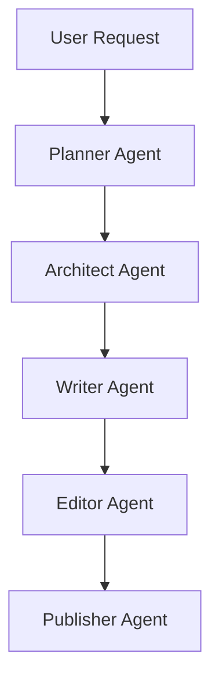

# Chinese WebNovel Master


> Don't just write novels. Engineer reader addiction.

Chinese WebNovel Master is a specialized writing workflow system designed for Chinese web fiction.

Unlike traditional writing tools, it focuses on the complete commercial web novel workflow:

* Market Analysis
* Story Planning
* World Building
* Chapter Writing
* Quality Review
* Publishing Optimization

The project uses a multi-agent architecture and an integrated knowledge base built from successful Chinese web fiction patterns.

---

## Features

### Market-Oriented Story Planning

Analyze:

* Genre trends
* Reader demand
* Platform suitability
* Commercial potential

Supported platforms:

* Tomato Novel (番茄小说)
* Qidian (起点中文网)
* Feilu (飞卢小说网)
* Jinjiang (晋江文学城)
* Qimao (七猫小说)
* Zongheng (纵横中文网)
* Ciweimao (刺猬猫)
* Boluobao (菠萝包轻小说)
* Xiaoxiang (潇湘书院)
* Hongxiu (红袖添香)
* 17K (17K小说网)
* Tadu (塔读文学)

---

## Quick Start

1. Start with [SKILL.md](SKILL.md), the entry point for the workflow.
2. Use the Planner role to prepare a market analysis and story architecture.
3. Draft chapters with the Writer role, then run the Editor review.
4. Use the Publisher role to prepare the title, synopsis, tags, and launch package.

For an example, begin with a genre from [examples](examples) and follow the full [workflow guide](docs/workflow.md).

### Multi-Agent Workflow

Chinese WebNovel Master simulates a professional web novel production team.

---

### Integrated Knowledge Base

Built-in writing knowledge includes:

* Platform-specific reader preferences
* Title generation patterns
* Suspense hook systems
* Character templates
* Power system templates
* Retention optimization frameworks

---

### Commercial Publishing Optimization

Generate:

* High CTR titles
* Platform-specific tags
* Novel synopsis
* Marketing copy
* Launch strategy

---

## Architecture


```mermaid
flowchart TD

A[User Request]
--> B[Planner Agent]

B --> C[Architect Agent]

C --> D[Writer Agent]

D --> E[Editor Agent]

E --> F[Publisher Agent]
```

## Example Workflows

| Genre | Example |
|--------|----------|
| Urban System | [urban_system.md](examples/urban_system.md) |
| Xianxia | [xianxia.md](examples/xianxia.md) |
| Apocalypse | [apocalypse.md](examples/apocalypse.md) |
| Romance | [romance.md](examples/romance.md) |


| Document | Description |
|----------|-------------|
| [quickstart.md](docs/quickstart.md) | Getting Started Guide |
| [architecture.md](docs/architecture.md) | System Architecture |
| [workflow.md](docs/workflow.md) | Full Workflow Guide |

---

## Project Structure

```text
Chinese-WebNovel-Master/

├── README.md
├── SKILL.md
├── LICENSE
├── ROADMAP.md
├── CHANGELOG.md
├── CONTRIBUTING.md

├── knowledge/
│   ├── Platform patterns (12): qidian, tomato, feilu, jinjiang, qimao, zongheng, ciweimao, boluobao, xiaoxiang, hongxiu, 17k, tadu
│   ├── Writing frameworks: title_patterns, suspense_hooks, character_templates, power_system_templates
│   ├── Genre patterns: genre_scifi, genre_suspense, genre_game, genre_era
│   │   ├── genre_historical_patterns.md
│   │   ├── genre_urban_supernatural_patterns.md
│   │   ├── genre_romance_patterns.md
│   │   └── genre_mythology_patterns.md

├── prompts/
│   ├── planner.md
│   ├── architect.md
│   ├── writer.md
│   ├── editor.md
│   └── publisher.md

├── tools/
│   ├── hook_generator.md
│   ├── retention_analyzer.md
│   ├── title_scorer.md
│   ├── story_bible.md
│   ├── golden_three_reviewer.md
│   ├── pacing_rhythm_map.md
│   ├── character_arc_tracker.md
│   ├── publishing_calendar.md
│   ├── cliffhanger_continuity_checker.md
│   └── style_sampler.md

├── examples/
│   ├── urban_system.md
│   ├── xianxia.md
│   ├── apocalypse.md
│   └── romance.md
```

---

## Knowledge Base

### Platform Patterns

| File                 | Purpose                          |
| -------------------- | -------------------------------- |
| tomato_patterns.md   | Tomato Novel market analysis     |
| qidian_patterns.md   | Qidian reader behavior           |
| feilu_patterns.md    | Feilu commercial patterns        |
| jinjiang_patterns.md | Female-oriented fiction patterns |
| qimao_patterns.md    | Qimao free-reading ad model and fast pacing       |
| zongheng_patterns.md | Zongheng paid subscription and long serialization |
| ciweimao_patterns.md | Ciweimao ACG community and concept-driven fiction |
| boluobao_patterns.md | Boluobao light novel romance and comedy           |
| xiaoxiang_patterns.md | Xiaoxiang female-oriented ancient and modern romance |
| hongxiu_patterns.md  | Hongxiu contemporary emotional fiction            |
| 17k_patterns.md      | 17K all-genre stable serialization                |
| tadu_patterns.md     | Tadu suspense and short-form quality              |

### Writing Frameworks

| File                      | Purpose                          |
| ------------------------- | -------------------------------- |
| title_patterns.md         | Title generation formulas        |
| suspense_hooks.md         | Chapter retention hooks          |
| character_templates.md    | Character construction templates |
| power_system_templates.md | Power system design templates    |

### Genre Patterns

| File | Purpose |
| ------------------------- | --------------------------------- |
| genre_scifi_patterns.md   | Sci-fi expectations, tech discipline, scale ladder |
| genre_suspense_patterns.md | Mystery architecture, fair-play reversals, clue discipline |
| genre_game_patterns.md    | System-flow panels, quest chains, cost mechanics |
| genre_era_patterns.md     | Era coordinates, period texture, era advantage rules |
| genre_historical_patterns.md | Historical/time-travel: era research, knowledge-advantage rules |
| genre_urban_supernatural_patterns.md | Urban system panels, 7 system types, progression ladder |
| genre_romance_patterns.md | Romance relationship arcs, 8 sub-variants, emotional resonance |
| genre_mythology_patterns.md | Mythological/cultivation world-building, power scales, sect politics |

### Tools

| File | Purpose |
| ------------------------- | --------------------------------- |
| hook_generator.md | Chapter-ending hook generation: 8 hook types, escalation ladder |
| retention_analyzer.md | Weighted retention scoring and failure diagnostics |
| title_scorer.md | Five-dimension title scoring for click-through |
| story_bible.md | Cross-chapter consistency ledger |
| golden_three_reviewer.md | First-three-chapter audit with GO / REVISE / REWRITE |
| pacing_rhythm_map.md | Satisfaction-density mapping over the ten-chapter engine |
| character_arc_tracker.md | Arc health flags |
| publishing_calendar.md | Serialized release cadence and backlog planning |
| cliffhanger_continuity_checker.md | Hook debt, variety and escalation audit |
| style_sampler.md | Author voice fingerprints and style profiles |

---

## Example Workflows

Complete end-to-end examples are provided.

### Urban System Novel

Demonstrates:

* Market analysis
* Wealth system design
* Chapter generation
* Editing process
* Publishing optimization

### Xianxia Novel

Demonstrates:

* Cultivation system design
* Sect structure
* Long-term progression
* Power scaling

### Apocalypse Novel

Demonstrates:

* Survival framework
* Resource economy
* Monster systems
* Escalating conflict

### Romance Novel

Demonstrates:

* Relationship progression
* Emotional hooks
* Character chemistry
* Reader retention techniques

---

## Tools

| Tool | When To Use |
|------|-------------|
| [hook_generator.md](tools/hook_generator.md) | Generate chapter-end hooks |
| [retention_analyzer.md](tools/retention_analyzer.md) | Score retention of drafted chapters |
| [story_bible.md](tools/story_bible.md) | Maintain cross-chapter consistency |
| [golden_three_reviewer.md](tools/golden_three_reviewer.md) | Audit the first three chapters |
| [pacing_rhythm_map.md](tools/pacing_rhythm_map.md) | Map satisfaction density and rhythm |
| [character_arc_tracker.md](tools/character_arc_tracker.md) | Track character arc health |
| [style_sampler.md](tools/style_sampler.md) | Sample author voice into a Style Profile |

---

## Agent Responsibilities

### Planner Agent

Responsible for:

* Market analysis
* Genre selection
* Commercial evaluation
* Platform targeting

### Architect Agent

Responsible for:

* World building
* Character design
* Power systems
* Plot architecture

### Writer Agent

Responsible for:

* Chapter generation
* Scene writing
* Dialogue
* Suspense creation

### Editor Agent

Responsible for:

* Consistency checks
* Logic review
* Pacing review
* Retention optimization

### Publisher Agent

Responsible for:

* Titles
* Synopsis
* Tags
* Marketing copy
* Launch strategy

---

## Why Chinese WebNovel Master?

Most writing tools optimize for writing quality.

Chinese WebNovel Master optimizes for:

* Reader retention
* Commercial viability
* Platform fit
* Emotional engagement
* Long-term serialization

The goal is not simply to create stories.

The goal is to create stories readers cannot stop reading.

---

## Roadmap

Current: v2.3.1 (2026-09-11)

* v1.0 — Core multi-agent workflow and knowledge base
* v1.1 — Expanded platform knowledge and publishing workflows
* v2.0 — Retention engine: automated evaluation and retention scoring
* v2.1 — Consistency layer: story bible, 3 new writing tools, 4 genre knowledge bases
* v2.1.1 — Expanded genre knowledge for historical fiction, urban supernatural, romance, and mythology
* v2.2 — Serialization operations: publishing calendar, cliffhanger checker, title scorer
* v2.3 — Author voice layer: style sampler, Style Profile sync in Writer/Editor
* v2.3.1 — Asset hygiene: strip provenance metadata from the workflow diagram

See [ROADMAP.md](ROADMAP.md) for the full plan and [CHANGELOG.md](CHANGELOG.md) for release history.

---

## License

MIT License

---

## Acknowledgements

Built for creators who want a repeatable Chinese web-fiction production workflow.

---
> 版本标记 v2.3.1：资源清理（剥离流程图 provenance 元数据）（2026-09-11）
> 版本标记 v2.3.0：作者语感层（style_sampler + Writer/Editor Style Profile 绑定）（2026-09-11）
> 版本标记 v2.2.0：连载运营（publishing calendar / cliffhanger checker / title scorer）（2026-09-11）
> 版本标记 v2.1.0：一致性层升级（story bible + 3 写作工具 + 4 题材知识库）（2026-09-08）
> 版本标记 v2.0.1：自动化协作流程验证（2026-09-04）
