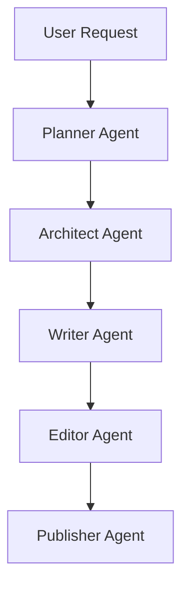

# System Architecture

## Overview

Chinese WebNovel Master uses a multi-agent architecture.

Each agent specializes in a different phase of web novel production.

---

## Workflow



---

## Planner Agent

Responsibilities:

* Market analysis
* Genre selection
* Reader targeting
* Commercial evaluation

Output:

* Market report
* Novel concept

---

## Architect Agent

Responsibilities:

* World building
* Character creation
* Power system design
* Long-term planning

Output:

* Novel blueprint

---

## Writer Agent

Responsibilities:

* Chapter generation
* Dialogue
* Hooks
* Conflict

Output:

* Manuscript

---

## Editor Agent

Responsibilities:

* Logic review
* Consistency review
* Pacing optimization

Output:

* Improved manuscript

---

## Publisher Agent

Responsibilities:

* Title generation
* Synopsis creation
* Marketing optimization

Output:

* Market-ready package

```
```
