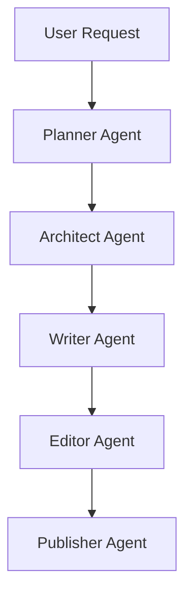

# Apocalypse Novel - Full Workflow Example

## Workflow

This example demonstrates how Chinese WebNovel Master transforms a survival-based apocalypse idea into a high-retention commercial web novel.

---

# User Request

写一本末日生存小说。

要求：

- 男频
- 末日废土
- 系统流
- 高压生存环境
- 爽文
- 节奏快
- 适合番茄小说平台

---

# Planner Output

## Market Analysis

Genre:

Apocalypse Survival System

Target Audience:

Male 18-40

Core Fantasy:

- 生存逆袭
- 无限升级
- 资源掠夺
- 建立势力
- 末日称王

Platform:

Tomato Novel

Commercial Potential:

9.6 / 10

Why It Works:

- 高压环境天然制造冲突
- 升级体系明确
- 爽点密集
- 长篇扩展空间大

---

# Architect Output

## World Setting

Year 2038.

未知病毒爆发。

全球秩序崩溃。

城市沦陷。

幸存者不足总人口的5%。

异兽开始进化。

人类进入废土时代。

---

## Power System

Survival System

Core Functions:

- Resource Detection
- Equipment Upgrade
- Shelter Construction
- Combat Enhancement
- Skill Evolution

---

## Main Character

Name:

Lin Mo

Background:

普通仓库管理员

Advantage:

获得末日生存系统

Goal:

建立人类最后的安全基地

---

## Major Threats

### Mutated Creatures

- Blood Wolf
- Iron Arm Ape
- Plague Spider

### Human Enemies

- Raiders
- Mercenary Groups
- Tyrant Warlords

---

## Long-Term Story Plan

Volume 1:

System Awakening

Volume 2:

City Escape

Volume 3:

Resource Competition

Volume 4:

Shelter Expansion

Volume 5:

Regional Alliance

Volume 6:

Warlord War

Volume 7:

Global Exploration

Volume 8:

Final Civilization Reconstruction

---

# Writer Output

## Chapter 1 Opening

夜晚。

暴雨倾盆。

林默躲在便利店角落。

外面传来凄厉惨叫。

三小时前。

世界变了。

新闻不断播报未知病毒扩散。

随后通讯中断。

军队失联。

城市陷入混乱。

就在此时。

一道机械声音突然响起。

【末日生存系统绑定成功】

【检测到宿主存活】

【奖励新手礼包】

【获得铁制长矛】

【获得压缩饼干×10】

【获得身体强化药剂×1】

林默瞳孔骤缩。

下一秒。

便利店大门轰然倒塌。

一头浑身腐烂的怪物冲了进来。

......

### Chapter Hook

- 世界崩溃
- 系统激活
- 生死危机
- 怪物登场
- 生存压力

---

# Editor Output

## Quality Review

Overall Score:

9.4 / 10

Hook Strength:

9.7 / 10

Commercial Potential:

9.6 / 10

Strengths:

- 开局直接进入末日
- 危机感极强
- 系统奖励形成爽点
- 主线目标明确

Weaknesses:

- 配角塑造不足
- 情感线较弱

Recommended Improvements:

- 增加固定队友
- 提升人性冲突
- 增加资源争夺战

---

# Publisher Output

## Title Candidates

1. 全球末日：我有生存系统
2. 末世：从便利店开始崛起
3. 末日废土：无限升级
4. 我在末世建立超级基地
5. 末世之最强生存者

---

## Platform Recommendation

Primary:

- 番茄小说

Secondary:

- 七猫小说

---

## Tags

- 末日
- 系统
- 生存
- 废土
- 基地建设
- 爽文

---

## Marketing Copy

末日降临。

秩序崩塌。

当所有人为食物拼命时。

林默获得了末日生存系统。

资源扫描。

装备升级。

基地建设。

从一个普通幸存者开始。

一步步建立人类最后的希望。
