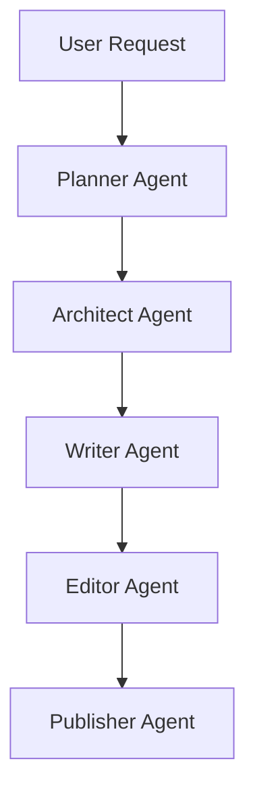

# Romance Novel - Full Workflow Example

## Workflow

This example demonstrates how Chinese WebNovel Master transforms a romance concept into a high-retention commercial web novel.

---

# User Request

写一本现代豪门甜宠小说。

要求：

- 女频
- 豪门总裁
- 先婚后爱
- 高糖甜宠
- 追妻火葬场
- 节奏快
- 适合番茄女频平台

---

# Planner Output

## Market Analysis

Genre:

Modern Romance

Target Audience:

Female 18-35

Core Fantasy:

- 被偏爱
- 被宠爱
- 高质量伴侣
- 情感满足
- 身份提升

Platform:

Tomato Novel

Commercial Potential:

9.5 / 10

Why It Works:

- 女性用户基数大
- 爽点与甜点结合
- 容易形成追更
- 高转化率题材

---

# Architect Output

## Main Characters

Female Lead:

Su Wan

Male Lead:

Gu Tingyan

---

## Relationship Arc

Stage 1:

Contract Marriage

Stage 2:

Living Together

Stage 3:

Mutual Attraction

Stage 4:

Major Conflict

Stage 5:

Pursuit and Redemption

Stage 6:

Happy Ending

---

## Supporting Characters

Best Friend:

Lin Xia

Rival:

Shen Yao

Family Elder:

Grandpa Gu

---

## Long-Term Story Plan

Volume 1:

Unexpected Marriage

Volume 2:

Developing Feelings

Volume 3:

Public Relationship

Volume 4:

Major Misunderstanding

Volume 5:

Breakup

Volume 6:

Winning Her Back

Volume 7:

Family Acceptance

Volume 8:

Perfect Ending

---

# Writer Output

## Chapter 1 Opening

民政局门口。

苏晚看着眼前高大的男人。

“顾先生。”

“我们真的要结婚吗？”

顾廷言神色平静。

“协议已经签了。”

“从今天开始。”

“你是顾太太。”

苏晚愣住了。

她怎么也没想到。

自己会因为一场意外。

嫁给整个江城最有权势的男人。

---

### Chapter Hook

- 豪门总裁
- 协议结婚
- 身份反差
- 高糖预期
- 强烈好奇心

---

# Editor Output

## Quality Review

Overall Score:

9.4 / 10

Hook Strength:

9.6 / 10

Emotional Engagement:

9.5 / 10

Commercial Potential:

9.5 / 10

Strengths:

- 开局直接进入婚姻关系
- 冲突明确
- 情感张力强
- 女频爽点清晰

Weaknesses:

- 需要增加配角戏份
- 后期误会需合理设计

Recommended Improvements:

- 增加情感递进
- 强化男主成长
- 丰富家庭矛盾

---

# Publisher Output

## Title Candidates

1. 闪婚后我成了首富夫人
2. 顾总每天都在追妻
3. 协议结婚后他动心了
4. 豪门闪婚：老公宠上天
5. 离婚后顾总跪求复婚

---

## Tags

- 豪门
- 甜宠
- 先婚后爱
- 追妻火葬场
- 女频
- 总裁

---

## Marketing Copy

一纸协议。

苏晚嫁给了全城最尊贵的男人。

原本以为只是利益交换。

却没想到。

那个冷漠矜贵的顾总。

渐渐把她宠成了全世界最幸福的人。
