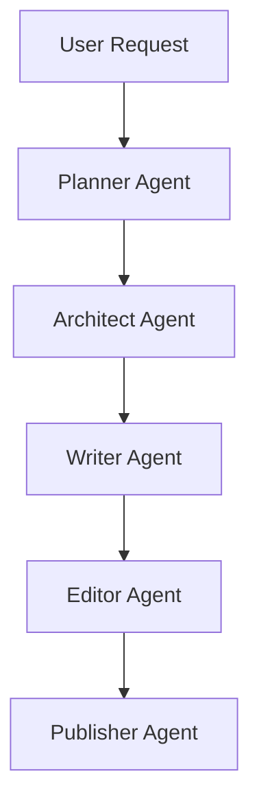

# Urban System Novel - Full Workflow Example

## Workflow

This example demonstrates how Chinese WebNovel Master transforms a simple novel idea into a market-ready web novel package.

---

## User Request

写一本番茄风都市神豪系统小说。

要求：

* 男频
* 爽文
* 系统流
* 现代都市
* 节奏快
* 适合番茄小说平台

---

# Planner Output

## Market Analysis

Genre:
Urban Wealth System

Target Audience:
Male 18-35

Core Fantasy:

* 财富自由
* 身份逆袭
* 社会地位提升
* 打脸成功人士

Platform:
Tomato Novel

Commercial Potential:
9.4/10

Why It Works:

* 爽点明确
* 门槛低
* 用户覆盖广
* 容易形成追读

---

# Architect Output

## World Setting

时间：

现代都市

地点：

上海

---

## System Design

系统名称：

财富增幅系统

规则：

第一天获得1000元。

之后每日翻倍。

Day 1:
1000元

Day 2:
2000元

Day 3:
4000元

Day 10:
512000元

Day 30:
超过5亿

---

## Main Character

姓名：

林辰

年龄：

22岁

身份：

应届毕业生

初始状态：

失业

租房

负债

目标：

实现财富自由

---

## Long-Term Plot

阶段1：

摆脱贫困

阶段2：

创业崛起

阶段3：

资本扩张

阶段4：

商业帝国

阶段5：

世界首富

---

# Writer Output

## Chapter 1

“您的账户收入1000000元。”

凌晨十二点。

林辰躺在出租屋的床上刷着招聘软件。

手机突然震动。

他下意识看了一眼。

下一秒。

整个人直接坐了起来。

到账短信。

中国建设银行。

收入：

1000000元。

余额：

1000123.56元。

林辰反复看了三遍。

第一反应不是兴奋。

而是诈骗。

他立刻打开银行APP。

登录。

查询。

余额页面缓缓刷新。

1000123.56。

一分不少。

“卧槽……”

林辰愣住了。

就在这时。

一道机械声音在脑海响起。

【财富增幅系统绑定成功】

【当前等级：Lv1】

【每日财富奖励已发放】

【明日奖励翻倍】

林辰瞳孔收缩。

翻倍？

什么意思？

系统界面出现。

今日奖励：

100万元。

明日奖励：

200万元。

后日奖励：

400万元。

第三日奖励：

800万元。

......

林辰呼吸越来越急促。

如果一直翻倍。

那岂不是……

几分钟后。

他算出了结果。

整个人直接沉默。

三十天后。

他将拥有数十亿资产。

“所以……”

“我发财了？”

这一刻。

窗外夜色依旧。

但林辰知道。

从今天开始。

他的人生彻底改变了。

---

# Editor Output

## Strengths

* 开局直接发钱
* 进入系统速度快
* 冲突明确
* 爽点即时兑现

## Weaknesses

* 配角尚未登场
* 外部压力不足

## Suggested Revisions

增加：

* 前女友看不起主角
* 面试失败情节
* 房东催租压力

提升代入感。

## Retention Score

9.2 / 10

---

# Publisher Output

## Recommended Title

毕业当天到账100万

---

## Alternative Titles

每天到账一个亿

神豪：从毕业开始暴富

我靠系统成为世界首富

财富翻倍：开局100万

---

## Synopsis

毕业即失业。

林辰正为房租发愁时。

账户突然到账100万元。

与此同时。

财富增幅系统正式绑定。

每天获得的财富都会翻倍。

当别人还在拼命上班时。

林辰已经踏上财富巅峰。

从出租屋到商业帝国。

从普通青年到世界首富。

属于林辰的传奇正式开始。

---

## Tags

都市

神豪

系统

爽文

逆袭

商业

首富

打脸

财富自由

男频

---

## Platform Recommendation

Tomato Novel

Score:

9.4 / 10
