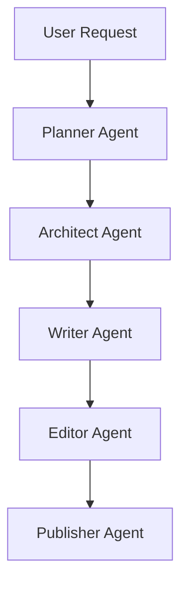

# Xianxia Novel - Full Workflow Example

## Workflow

This example demonstrates how Chinese WebNovel Master transforms a traditional cultivation novel idea into a market-ready web novel package.

---

# User Request

写一本修仙小说。

要求：

* 男频
* 凡人流
* 慢热成长
* 长生主题
* 宗门体系
* 炼丹炼器
* 秘境探索
* 适合起点中文网
* 预计300万字

---

# Planner Output

## Market Analysis

Genre:
Traditional Xianxia

Target Audience:
Male 18-40

Platform:
Qidian

Trend Analysis:

* 长生流持续热门
* 凡人修仙接受度高
* 宗门成长路线成熟
* 秘境探索具有稳定追读能力

Core Fantasy:

* 从凡人到仙帝
* 长生不死
* 无限成长
* 掌控天道
* 宗门崛起

Commercial Potential:
9.6 / 10

Risk Assessment:

* 前期节奏过慢
* 境界升级拖沓
* 世界观过度复杂

Recommended Strategy:

* 第一卷快速入宗
* 第三章获得金手指
* 每20章一个小高潮
* 每100章一个大高潮

---

# Architect Output
---

# Writer Output

## Chapter 1

青云山下。

晨雾缭绕。

陆长青背着药篓，沿着山路缓缓前行。

作为青石村最普通的少年，他从未想过自己有一天会踏上修仙之路。

父亲是灵农。

母亲早亡。

家中仅有三亩灵田。

若无意外，他的一生都会在这片山谷中度过。

然而就在三日前。

他在后山采药时发现了一块残破玉佩。

玉佩之中隐藏着一道古老传承。

【悟性系统已激活】

【当前悟性：1】

【是否推演《基础吐纳诀》？】

陆长青愣住。

下一刻。

无数修炼感悟涌入脑海。

原本晦涩难懂的吐纳诀竟瞬间融会贯通。

【推演完成】

【基础吐纳诀 → 长青吐纳诀】

【修炼速度提升300%】

陆长青握紧拳头。

命运。

似乎从这一刻开始改变。

---

## Chapter Hook Analysis

Reader Curiosity:

- 玉佩来源是什么？
- 系统来自哪里？
- 主角未来能达到什么境界？

Conflict:

- 资质平庸
- 家境贫寒
- 资源匮乏

Retention Score:

9.2 / 10
## World Structure

Mortal Realm

↓

Spirit Realm

↓

Immortal Realm

↓

Divine Realm

## Cultivation System

1. Qi Refining
2. Foundation Establishment
3. Golden Core
4. Nascent Soul
5. Spirit Transformation
6. Void Refinement
7. Integration
8. Mahayana
9. Tribulation
10. True Immortal

## Protagonist

Name:
Lu Changqing

Background:

* 灵农之子
* 五灵根
* 天赋普通

Golden Finger:

Enlightenment System

Features:

* 自动推演功法
* 提升悟性
* 优化丹方
* 解析阵法

Goal:

Achieve Eternal Life

## Major Factions

Azure Cloud Sect

Blood Demon Palace

Heavenly Sword Pavilion

Ancient Immortal Clan

Celestial Court

## Long-Term Story Plan

Volume 1:
Entering the Sect

Volume 2:
Foundation Establishment

Volume 3:
Secret Realm Competition

Volume 4:
Regional War

Volume 5:
Spirit Realm Ascension

Volume 6:
Immortal Realm Journey

Volume 7:
Heavenly Dao Conflict

Volume 8:
Final Ascension

---

# Writer Output

## Chapter 1 Opening

青云山。

清晨。

陆长青背着药篓穿行于山路之间。

三个月前。

他穿越到了这个修仙世界。

没有灵根。

没有背景。

甚至连进入宗门的资格都没有。

就在所有人都认为他此生只能做个凡人时。

一道声音忽然在脑海响起。

【悟性系统已激活】

【宿主阅读《基础吐纳诀》】

【悟性+100】

【自动推演中……】

【获得《先天混元呼吸法》】

陆长青愣在原地。

下一刻。

天地灵气疯狂涌来。

......

### Chapter Hook

- 穿越
- 系统激活
- 悟性逆天
- 功法升级
- 快速爽点
---

# Editor Output

## Quality Review

Overall Score:
9.3 / 10

Hook Strength:
9.5 / 10

Commercial Potential:
9.4 / 10

Character Appeal:
8.9 / 10

Strengths:

- 开局直接激活系统
- 爽点出现速度快
- 主线目标清晰
- 符合起点男频读者偏好

Weaknesses:

- 反派缺失
- 情绪冲突偏弱

Recommended Improvements:

- 增加宗门考核竞争
- 增加天才弟子压迫感
- 提前埋下宗门阴谋
- 
---

# Publisher Output

## Title Candidates

1. 悟性逆天：我在修仙界开挂
2. 长生从悟性满级开始
3. 修仙：我的悟性无限提升
4. 我能推演万法
5. 开局悟性逆天

## Platform Recommendation

Primary:
- 起点中文网

Secondary:
- 番茄小说

## Tags

- 修仙
- 系统
- 悟性流
- 长生
- 无敌流
- 爽文

## Marketing Copy

穿越修仙界。

别人苦修十年。

陆长青一眼顿悟。

当所有人还在练基础功法时。

他已经开始推演仙法。

这是一个悟性逆天者横推修仙界的故事。
