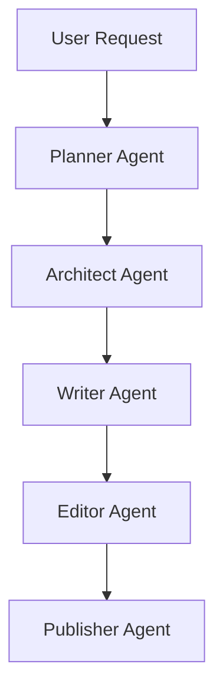

# Xianxia Novel - Full Workflow Example

## Workflow

This example demonstrates how Chinese WebNovel Master transforms a traditional cultivation novel idea into a market-ready web novel package.

---

# User Request

写一本修仙小说。

要求：

* 男频
* 凡人流
* 慢热成长
* 长生主题
* 宗门体系
* 炼丹炼器
* 秘境探索
* 适合起点中文网
* 预计300万字

---

# Planner Output

## Market Analysis

Genre:
Traditional Xianxia

Target Audience:
Male 18-40

Platform:
Qidian

Trend Analysis:

* 长生流持续热门
* 凡人修仙接受度高
* 宗门成长路线成熟
* 秘境探索具有稳定追读能力

Core Fantasy:

* 从凡人到仙帝
* 长生不死
* 无限成长
* 掌控天道
* 宗门崛起

Commercial Potential:
9.6 / 10

Risk Assessment:

* 前期节奏过慢
* 境界升级拖沓
* 世界观过度复杂

Recommended Strategy:

* 第一卷快速入宗
* 第三章获得金手指
* 每20章一个小高潮
* 每100章一个大高潮

---

# Architect Output

## World Structure

Mortal Realm

↓

Spirit Realm

↓

Immortal Realm

↓

Divine Realm

## Cultivation System

1. Qi Refining
2. Foundation Establishment
3. Golden Core
4. Nascent Soul
5. Spirit Transformation
6. Void Refinement
7. Integration
8. Mahayana
9. Tribulation
10. True Immortal

## Protagonist

Name:
Lu Changqing

Background:

* 灵农之子
* 五灵根
* 天赋普通

Golden Finger:

Enlightenment System

Features:

* 自动推演功法
* 提升悟性
* 优化丹方
* 解析阵法

Goal:

Achieve Eternal Life

## Major Factions

Azure Cloud Sect

Blood Demon Palace

Heavenly Sword Pavilion

Ancient Immortal Clan

Celestial Court

## Long-Term Story Plan

Volume 1:
Entering the Sect

Volume 2:
Foundation Establishment

Volume 3:
Secret Realm Competition

Volume 4:
Regional War

Volume 5:
Spirit Realm Ascension

Volume 6:
Immortal Realm Journey

Volume 7:
Heavenly Dao Conflict

Volume 8:
Final Ascension
